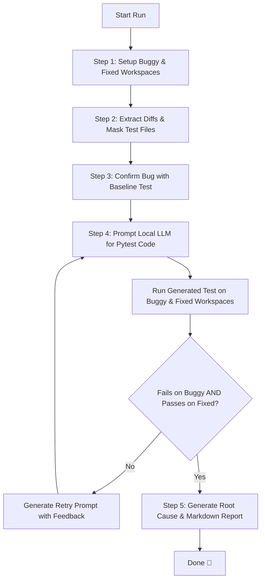

# 🛡️ Regression Guard

**Automated Anti-Leakage AI Boundary Regression Test Generator & Bug Reporter**

[](https://www.python.org/downloads/)
[](https://docs.pytest.org/)
[](https://ollama.com/)
[](LICENSE)

Repository: [https://github.com/nandan91531/Regression-Guard.git](https://github.com/nandan91531/Regression-Guard.git)

---

## 📖 Overview

**Regression Guard** is a developer tool that automatically writes and validates Python boundary regression tests for bug fixes using local Large Language Models (LLMs) via **Ollama**.

When a bug is fixed in a project, developers need a regression test to make sure the bug never comes back. However, writing precise boundary tests manually is time-consuming, and standard AI coders often cheat by copying expected output strings directly out of test error logs.

**Regression Guard** solves this problem by using **anti-leakage diff filtering**, **log sanitization**, and **isolated dual-workspace execution**. It creates a test, runs it against both the **buggy code** and the **fixed code**, and ensures the test strictly **FAILS on the buggy version** and **PASSES on the fixed version**. If the test isn't quite right, Regression Guard diagnoses the mistake and retries automatically until a valid test is found.

---

## 🌟 Key Features

- 🛡️ **Anti-Leakage Diff Filtering**: Strips human-written test changes from the Git diff provided to the AI. The AI must figure out the boundary bug from the source code fix alone.
- 🔒 **Log Sanitization**: Replaces expected output values in failure logs with `[HIDDEN - infer this from the fix logic]`. This prevents the LLM from simply copying answers.
- ⚡ **Dual-Workspace Sandbox**: Clones isolated copies of both buggy and fixed commits (`buggy_workspace` and `fixed_workspace`) to execute tests side-by-side without polluting your main repo.
- 🔄 **Self-Correcting Validation Loop**: Automatically runs AI-generated tests on both environments. If a test passes on buggy code or fails on fixed code, it feeds detailed feedback back to the LLM for self-correction.
- 📊 **Automated Root Cause Reports**: Produces a clean, ready-to-share Markdown report (`regression_report.md`) containing the diff, plain-English root cause explanation, accepted pytest code, and raw test execution logs.
- 🖥️ **Web Dashboard & Real-Time SSE Logs**: Includes a sleek dark-mode web app (`server.py`) with real-time log streaming using Server-Sent Events (SSE), a step progress bar, and instant report previews.
- 🧩 **Smart Package Handling**: Automatically handles dynamic version files (like `_version.py`) to prevent import errors during automated testing.

---

## 🏗️ Project Architecture

```
Regression-Guard/
├── main.py                     # CLI entry point script
├── server.py                   # HTTP web server & SSE API backend
├── regression_report.md        # Sample generated Markdown report
├── regression_guard/           # Core Python package
│   ├── __init__.py
│   ├── cli.py                  # Pipeline orchestrator & CLI handler
│   ├── config.py               # Settings & command-line argument parser
│   ├── git_utils.py            # Git cloning, checkout, & diff extraction
│   ├── llm_client.py           # Ollama API client with timeout handling
│   ├── prompt_builder.py       # Prompt templates & self-correction prompts
│   ├── reporter.py             # Markdown report builder
│   ├── sanitizer.py            # Failure log masking & code extraction
│   └── test_runner.py          # Pytest execution & environment manager
├── ui/                         # Web Dashboard frontend
│   ├── index.html              # Interface layout & stepper UI
│   ├── style.css               # Modern dark-mode styling
│   └── app.js                  # Frontend logic & SSE stream connection
└── tests/                      # Unit test suite for Regression Guard
    └── test_sanitizer.py       # Sanitizer module unit tests
```

---

## 🔄 How It Works (Step-by-Step)



1. **Workspace Setup**: Clones the target repo into two temporary folders and checks out the `buggy` and `fixed` commit hashes.
2. **Diff Extraction**: Extracts the source code diff while filtering out test files to prevent hint leakage.
3. **Bug Confirmation**: Runs the human-written test to verify that it fails on the buggy commit and passes on the fixed commit.
4. **AI Generation & Validation Loop**:
   - Sends sanitized failure logs and source diffs to Ollama.
   - Saves the generated Python test in both workspaces and runs `pytest`.
   - Checks the result:
     - ❌ **Passed on both?** The test didn't hit the boundary condition.
     - ❌ **Failed on both?** The test has a syntax error or wrong assumption.
     - ❌ **Passed on buggy / Failed on fixed?** The test asserted the old buggy behavior instead of the fix.
     - ✅ **Failed on buggy & Passed on fixed?** Success! Test accepted.
   - If invalid, sends diagnostic feedback to the LLM and retries (up to `--max-attempts`).
5. **Report Generation**: Asks the LLM for a plain-language root cause explanation, compiles the evidence, and saves `regression_report.md`.

---

## 💻 Installation & Setup

### Prerequisites

1. **Python 3.9+** installed on your system.
2. **Git** installed and available in your PATH.
3. **Ollama** installed and running locally.
   - Download Ollama from [ollama.com](https://ollama.com/)
   - Pull a model (e.g. Llama 3.2):
     ```bash
     ollama pull llama3.2
     ```
   - Make sure Ollama server is running:
     ```bash
     ollama serve
     ```

### Installation Steps

1. **Clone the repository**:
   ```bash
   git clone https://github.com/nandan91531/Regression-Guard.git
   cd Regression-Guard
   ```

2. **Create and activate a virtual environment (optional but recommended)**:
   - On Windows (PowerShell):
     ```powershell
     python -m venv venv
     .\venv\Scripts\Activate.ps1
     ```
   - On Linux/macOS:
     ```bash
     python3 -m venv venv
     source venv/bin/activate
     ```

3. **Install required dependencies**:
   ```bash
   pip install requests pytest
   ```

---

## 🚀 How to Use

You can run Regression Guard in two ways: via the **Web Dashboard UI** or through the **Command Line (CLI)**.

---

### Option 1: Web Dashboard UI (Recommended)

Regression Guard comes with a built-in web browser interface featuring live log streaming.

1. **Start the Web Server**:
   ```bash
   python server.py
   ```
2. **Open in Browser**:
   Navigate to `http://127.0.0.1:8000` in your web browser.
3. **Configure & Run**:
   - Enter the target repository path/URL, buggy commit hash, fixed commit hash, and target test file.
   - Select your available Ollama model from the dropdown.
   - Click **Run Regression Guard** to see step-by-step progress, terminal output, accepted pytest code, and the final report.

---

### Option 2: Command Line Interface (CLI)

Run directly from your terminal using default options or custom flags:

#### Default Run (Uses bundled `humanize` sample repo):
```bash
python main.py
```

#### Custom Run Example:
```bash
python main.py \
  --repo "humanize" \
  --buggy "7574e0c" \
  --fixed "823ad60" \
  --test-file "tests/test_filesize.py" \
  --model "llama3.2" \
  --max-attempts 3 \
  --timeout 180
```

#### Available CLI Arguments:

| Argument | Type | Default | Description |
| :--- | :--- | :--- | :--- |
| `--repo` | `str` | `humanize` | Path or URL of the target Git repository |
| `--buggy` | `str` | `7574e0c` | Commit hash for the buggy state |
| `--fixed` | `str` | `823ad60` | Commit hash for the fixed state |
| `--test-file` | `str` | `tests/test_filesize.py` | Target test file path inside the repo |
| `--src-subfolder` | `str` | `src` | Subfolder containing Python package source code |
| `--model` | `str` | `llama3.2` | Ollama model name to use |
| `--ollama-url` | `str` | `http://localhost:11434` | Base URL of local Ollama API server |
| `--timeout` | `int` | `180` | HTTP request timeout for LLM calls (in seconds) |
| `--max-attempts` | `int` | `3` | Maximum retry attempts for AI test generation |
| `--output-report` | `str` | `regression_report.md` | Path where the final report markdown file will be saved |
| `--buggy-workspace`| `str` | `buggy_workspace` | Directory name for buggy workspace clone |
| `--fixed-workspace`| `str` | `fixed_workspace` | Directory name for fixed workspace clone |
| `--keep-workspaces`| `flag`| `False` | Retain temporary workspace folders after completion |

---

## 🧪 Running Unit Tests

To verify that Regression Guard's internal sanitizer and code extraction modules are working properly, run pytest:

```bash
python -m pytest tests/
```

---

## 📊 Example Report Output

When Regression Guard finishes, it outputs a detailed report like `regression_report.md`:

````markdown
# Regression Guard Report

## Bug Diff
[Full git diff showing source code changes]

## Root Cause
Plain-language explanation generated by Ollama describing why the bug occurred.

## Accepted Regression Test
```python
import humanize

def test_filesize_boundary():
    assert humanize.naturalsize(999999) == '1.0 MB'
```

## Validation Evidence
### Ran on BUGGY version:
FAILED (AssertionError: '1000.0 kB' != '1.0 MB')

### Ran on FIXED version:
PASSED

## Conclusion
The above test fails on the buggy version and passes on the fixed version, confirming this test correctly captures the reported bug.
````

---

## 🤝 Contributing

Contributions are welcome! If you find a bug, have an idea for a feature, or want to improve the prompts or UI:

1. Fork the repository: `https://github.com/nandan91531/Regression-Guard.git`
2. Create a feature branch (`git checkout -b feature/amazing-feature`)
3. Commit your changes (`git commit -m 'Add amazing feature'`)
4. Push to the branch (`git push origin feature/amazing-feature`)
5. Open a Pull Request

---

## 📜 License

This project is licensed under the MIT License. Feel free to use, modify, and distribute it.
